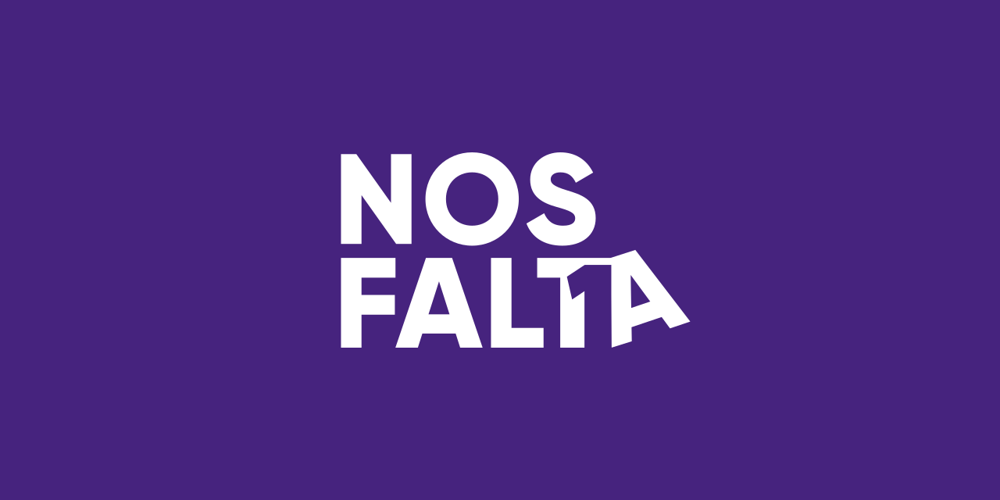

<p align="center">
  
</p>

# NosFaltaUno

## Description

This repository is one of the activities of the [Free Software Club from the University of Córdoba](https://uco.es/aulasoftwarelibre) and has only educational purposes.

"NosFaltaUno" is a notice board that allows you to find people with your same interests.

This repository contains the backend of the application.

## Installation

```bash
$ yarn install
```

## Running the app

```bash
# run docker first
$ docker-compose up -d

# development
$ yarn run start

# watch mode
$ yarn run start:dev

# production mode
$ yarn run start:prod
```

## Test

```bash
# unit tests
$ yarn run test

# e2e tests
$ yarn run test:e2e

# test coverage
$ yarn run test:cov
```

NosFaltaUno is [AGPL3 licensed](LICENSE).
